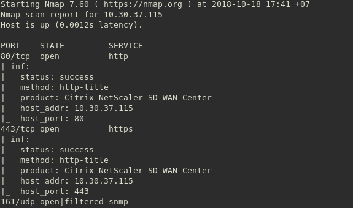

# SD-WAN Infiltrator
`SD-WAN Infiltrator` is an NSE script to automatically discover SD-WAN nodes in a local network. It uses [SD-WAN Census Database](https://github.com/sdnewhop/sdwannewhope/blob/master/census.md).

# Dependencies
Nmap libraries:
```
comm
string
table
shortport
nmap
stdnse
lpeg-utility
http
snmp
sslcert
tls
url
```

# Installation
1. Locate, where your nmap scripts are located in your system:
* for *nix system it might be  `~/.nmap/scripts/` or `$NMAPDIR`
* for Mac it might be `/usr/local/Cellar/nmap/<version>/share/nmap/scripts/`
* for Windows you have to find it yourself

2. Copy `infiltrator.nse` into that directory.

# Usage
```
nmap --script infiltrator --script-args infiltrator.version=true -sS -sU -p U:161,T:80,443,8008,8080,8443 <target> or -iL <targets.txt>
```
# Example

